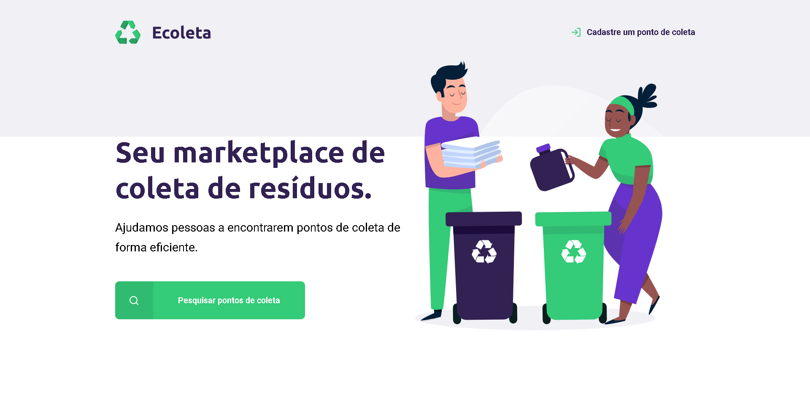
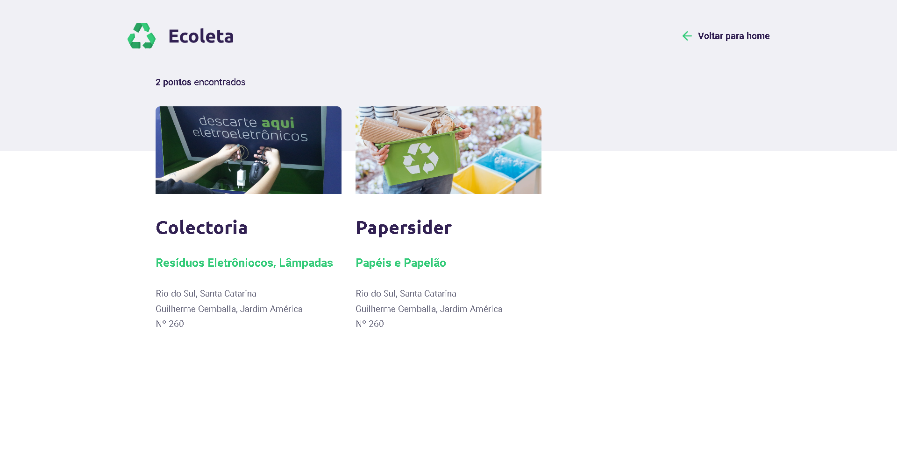
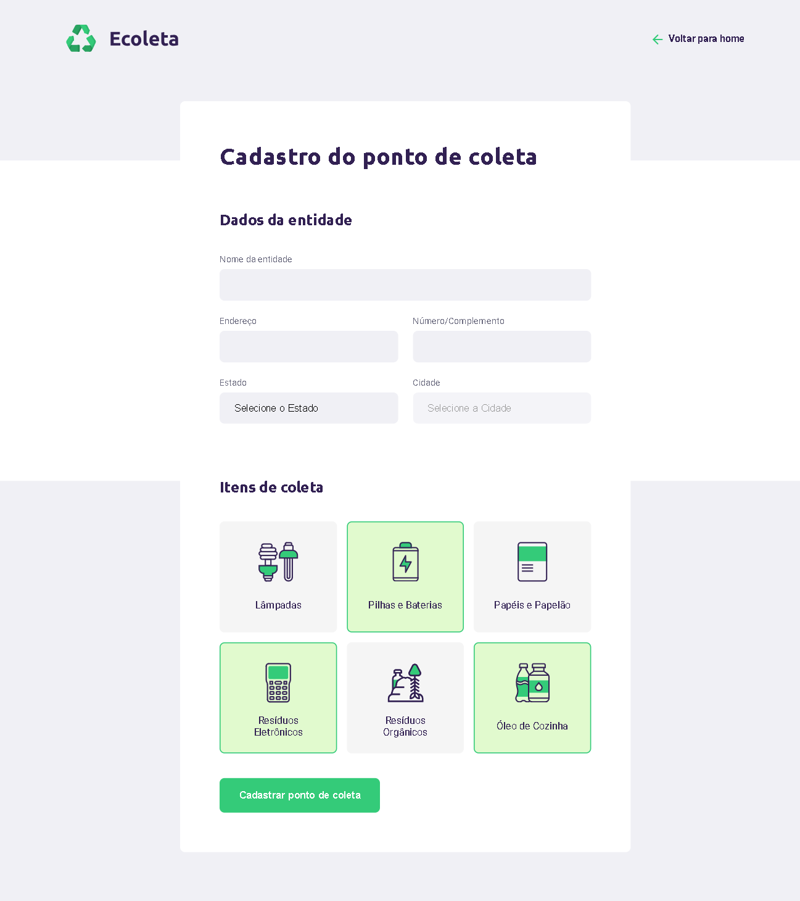

<h1 align="center"> Projeto Ecoleta | NLW Rocketseat </h1>

  <a href="#-tecnologias">Tecnologias</a>&nbsp;&nbsp;&nbsp;|&nbsp;&nbsp;&nbsp;
  <a href="#-projeto">Projeto</a>&nbsp;&nbsp;&nbsp;|&nbsp;&nbsp;&nbsp;
  <a href="#-funcionalidades">Funcionalidades</a>&nbsp;&nbsp;&nbsp;&nbsp;&nbsp;&nbsp;

 

  

  

  

### 🚀 Tecnologias

Esse projeto foi desenvolvido com as seguintes tecnologias:

- HTML5
- CSS
- JavaScript
- Git e Github

### 💻 Projeto

- [Acesse o projeto finalizado, online.](https://devgaab.github.io/proj-ecoleta-nlwrocketsest/)
    
O Ecoleta é um mercado que ajuda as pessoas a encontrar pontos de coleta de resíduos de forma eficiente.

### ⚙ Funcionalidades

- Web Responsivo
- Página com formulário
- Modal pop-up
- Botões com redirecionamento
- Barra de pesquisa

---